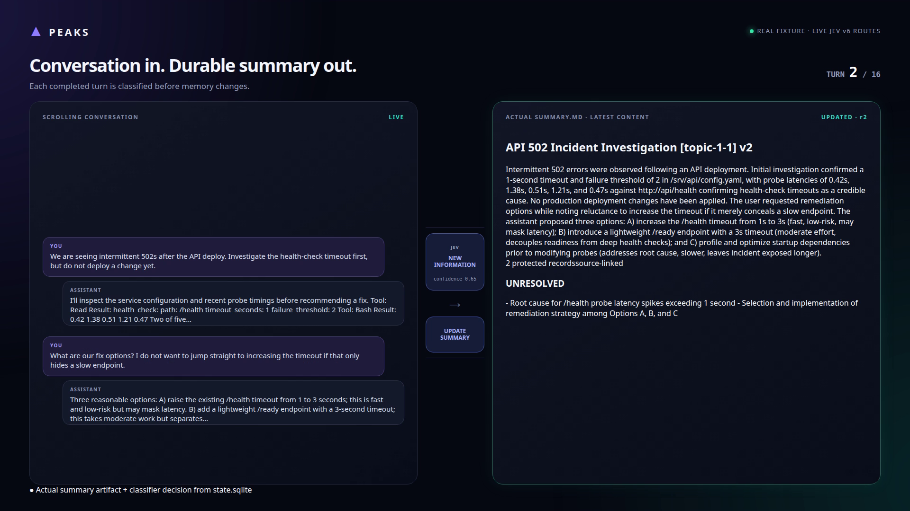

# Peaks

An MVP live conversation summarizer. It reads completed conversation chunks as they are submitted and maintains a separate, topic-organized summary, backed by an append-only source archive and audit journal. It never modifies the conversation it reads. Handoffs and context compaction may consume the summary later, but they are not responsibilities of Peaks.

## Demo

[](demo/peaks-live-demo.mp4)

The demo uses the tracked 16-turn incident fixture and its real Jev routing decisions. Conversation turns scroll on the left, Jev classifies each completed turn in the center, and the actual summary updates—or remains unchanged—on the right.

[Watch the MP4](demo/peaks-live-demo.mp4?raw=1) · 35 seconds, 1920×1080, H.264. GitHub does not embed the player in this README; click the cover or link to play it.

## Run it on a real conversation

Requirements: [Bun](https://bun.sh), a Claude Code conversation, a TypeSafe/Jev bearer key, and an OpenAI-, Anthropic-, or OpenRouter-compatible writer model.

```sh
bun install
cp .env.example .env
# Replace the placeholder keys and writer model in .env.
bun run summarize --tools
```

The command finds your most recently modified Claude Code transcript, processes every completed turn, prints the summary, and writes it to:

```text
peaks/<session-id>.md
```

Have another exchange in that Claude Code session and run `bun run summarize --tools` again to see the same file update. Pass a transcript explicitly when the latest session is not the one you want:

```sh
bun run summarize --tools /path/to/session.jsonl
```

Omit `--tools` to summarize only user prompts and assistant text. With `--tools`, Peaks also reads completed tool calls and their results.

## Update automatically after every turn

Install the Claude Code Stop hook once. Replace `/absolute/path/to/peaks` with this checkout's absolute path in `~/.claude/settings.json`:

```json
{
  "hooks": {
    "Stop": [
      {
        "hooks": [
          {
            "type": "command",
            "command": "bun /absolute/path/to/peaks/src/hosts/claude_code/hook.ts --mode tools"
          }
        ]
      }
    ]
  }
}
```

Keep `.env` in the Peaks checkout. After each completed Claude Code turn, the hook updates `peaks/<session-id>.md` inside the project where that conversation is running. Worker timing and errors are recorded in `peaks/.state/<session-id>.log`.

The hook runs in shadow mode today: Jev records its routing decision, while the writer independently assesses every completed turn. See [the hook guide](docs/claude-code-hook.md) for processing details, file locations, limitations, and the difference between chat and tools modes.

## Development and fixture replay

```sh
bun install
bun run typecheck
bun run lint
bun test
bun run replay --fixtures fixtures/deterministic --adapters stub
```

The tracked design is [docs/topic-compactor-spec.md](docs/topic-compactor-spec.md). Project conventions and toolchain decisions are recorded in [CLAUDE.md](CLAUDE.md). Replay, threshold sweeps, and report metrics are covered in [docs/evaluation.md](docs/evaluation.md); the Jev classifier's verified provider facts and question templates are in [docs/jev-adapter.md](docs/jev-adapter.md).

## Configuration

Stub and recorded replays need no configuration. Live adapters read the environment once at startup through `loadConfig`; credentials never enter prompts, fixtures, or journals.

| Variable | Default | Purpose |
| --- | --- | --- |
| `JEV_BEARER_KEY` | required | System One bearer key |
| `JEV_MODEL` | `jev-1.13.0` | Pinned; any other value is rejected |
| `JEV_ENDPOINT` | `https://api.typesafe.ai/v1/systemone` | |
| `JEV_DEADLINE_MS` | `30000` | Per Jev request, including retries |
| `JEV_MAX_INPUT_TOKENS` / `JEV_CONTEXT_TOKENS` | `32000` / `64000` | Request batching bounds |
| `WRITER_PROVIDER` | `openai` | `openai`, `anthropic`, or `openrouter` (chat completions, routed only to endpoints that support structured output) |
| `WRITER_MODEL` | required | For OpenRouter, a `vendor/model` slug that supports structured outputs |
| `WRITER_API_KEY` | falls back to `OPENAI_API_KEY` / `ANTHROPIC_API_KEY` / `OPENROUTER_API_KEY` | |
| `WRITER_ENDPOINT` | provider default | |
| `WRITER_DEADLINE_MS` | `30000` | |
| `WRITER_MAX_INPUT_TOKENS` | `32000` | |
| `EVALUATOR_PROVIDER`, `EVALUATOR_MODEL`, `EVALUATOR_API_KEY` | the writer's values | Model and key are required when the evaluator uses a different provider |
| `EVALUATOR_ENDPOINT`, `EVALUATOR_DEADLINE_MS`, `EVALUATOR_MAX_INPUT_TOKENS` | as for the writer | |
| `AUDIT_DEADLINE_MS` | `2000` | Inline active-mode bypass audit |
| `SHADOW_COMPARISON_DEADLINE_MS` | `2000` | Shadow semantic comparison |

`WRITER_PROMPT_VERSION` and `EVALUATOR_PROMPT_VERSION` may be set only to the versions compiled into the code; they exist so a deployment can assert the prompt it expects.

## Ingestion

Production ingestion must provide a summary budget: `maxTokens` bounds the whole rendered summary (protected records plus topic summaries), and `summaryBudgetTokens` bounds its topic section.

```ts
const pipeline = new CompactPipeline({
  store,
  classifier,
  writer,
  evaluator,
  classifierPolicy,
  executionPolicy, // defaults to shadow
  budget: {
    maxTokens: 6_000,
    summaryBudgetTokens: 4_000,
    tokenizer: readerModelTokenizer,
  },
});
```

The pipeline starts in shadow mode: the writer assesses every chunk and its validated patch is committed, while classifier routing is only recorded. `executionPolicy.mode: "active"` lets the classifier bypass the writer, with sampled bypass audits at `bypassAuditRate`. The separate pipeline option `mode: "baseline"` is the always-writer comparison that skips classification. The evaluator is optional; without it, shadow comparisons and audits record no semantic verdict.

After each commit, `renderSummary(memory, budget)` renders the summary: active protected records, then topic summaries with unresolved issues and source provenance. Ingest counts that same rendering, so it rejects or compresses an over-budget candidate before the atomic memory/processed-marker commit. Render-time compression is an ephemeral display facility and never changes authoritative memory.
